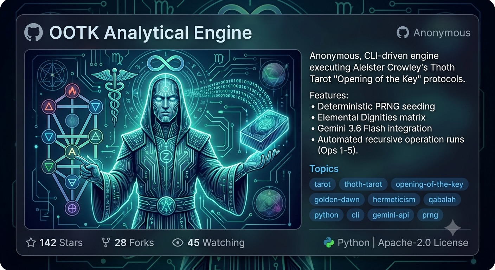

# OOTK Thoth Vector Engine



> A deterministic, non-conversational LLM system protocol for executing Opening of the Key (OOTK) Hermetic Tarot operations, Elemental Dignity calculations, and quantitative vector analysis using Aleister Crowley’s Thoth Tarot framework.

---

## Overview

The **OOTK Thoth Vector Engine** converts large language models into deterministic analytical processors. It bypasses standard conversational filler, psychological projection, and intuitive tarot interpretation. Instead, it processes spread topologies strictly via:

* **Golden Dawn & Liber 777 Attributions:** Direct Kabbalistic, Zodiacal, and Decan mapping.
* **100% Upright Orientation:** Strict elimination of reversed card mechanics in accordance with traditional Thoth and Golden Dawn protocols (adverse aspects are calculated purely via Elemental Dignities).
* **Crowley/Thoth Mechanics:** Proper suit nomenclature (**Disks**) and accurate card-counting step values (Aces=1, Minors=2–10, Courts=4, **Princesses=7**, Majors=3/5/9 based on letter classification).
* **Multi-Layer Elemental Vector Matrix:** Quantitative vector arithmetic evaluating Fire ($\Delta$), Air ($\Delta$), Water ($\nabla$), and Earth ($\nabla$) interaction coefficients ($V$).

---

## Repository Structure

| File Path | Description |
| :--- | :--- |
| `README.md` | Repository documentation and user guide. |
| `prompts/ootk_thoth_vector_engine.md` | Core OOTK system prompt protocol (General Spread / Vector Analysis). |
| `prompts/ootk_operation_2_piles.md` | Specialized system prompt for **Operation 2** (The 4 Elemental Piles: YHVH). |
| `config/default_params.json` | Default runtime parameters (PRNG seeds, target topics, and operations). |
| `scripts/runner.py` | Python CLI helper script to format parameters and compile runtime prompts. |

---

## Quick Start

### 1. Manual LLM Injection
Copy the full text inside either [`prompts/ootk_thoth_vector_engine.md`](prompts/ootk_thoth_vector_engine.md) or [`prompts/ootk_operation_2_piles.md`](prompts/ootk_operation_2_piles.md) and paste it as the **System Instruction / System Prompt** in your LLM interface (OpenAI Playground, Gemini API, or Claude System Prompt).

Append your execution block at the end:

```text
[RUNTIME PARAMETER EXECUTION BLOCK]
* Target Topic: Strategic Infrastructure Consolidation
* PRNG Seed: 43765590443
* Target Operation: Operation 1

