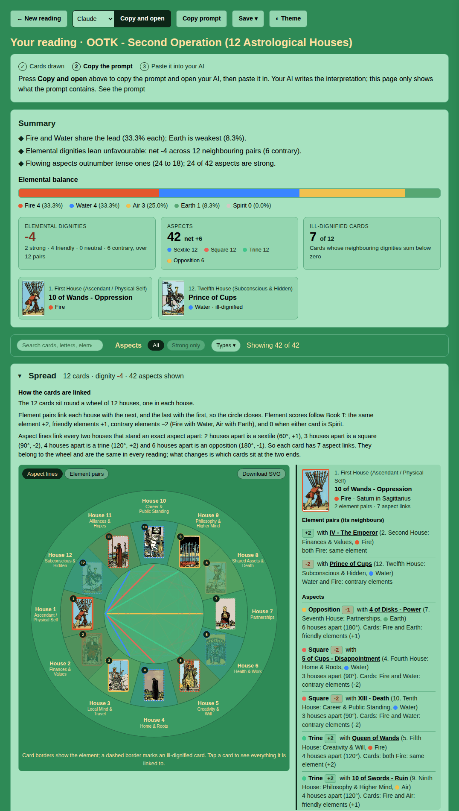

# OOTK Thoth Engine

**OOTK is a neutral instruction set for an LLM to interpret a tarot reading.** It draws a Thoth spread from a seed you can repeat, works out its elemental dignities, aspects and Liber 777 correspondences (up to the full Opening of the Key), and writes them up as a prompt you paste into an LLM. It does not interpret the cards itself.

**Try it online: [ootk.onrender.com](https://ootk.onrender.com)** (free hosting, so the first visit after a quiet spell takes about a minute to wake up). Card images there are Pamela Colman Smith's public-domain 1909 Rider-Waite-Smith art, because the Thoth paintings are copyrighted.



A Hermetic tarot calculation and analytical engine built around the 78-card Thoth deck, Liber 777 correspondences, and Tree of Life spatial/Platonic geometry.

It automates the Opening of the Key (OOTK) pipeline: elemental dignities, Hebrew letter and path attributions, Platonic solid dual inversions, and decanic zodiacal aspects. Draws are deterministic: the same seed always gives the same deck order.

---

## Features

- **Spreads 1-12**, from a single card up to the full 4-operation OOTK master pipeline (key 12):
  - Operation 1: a 15-card heap (core nature and climax). This is a variant, not the classic OOTK First Operation, which splits the whole deck into four IHVH piles
  - Operation 2: 12 astrological houses
  - Operation 3: 12 zodiacal signs
  - Operation 4: 36 decans, each labelled with its ruler, sign and pip (Decan 1: Mars in Aries (2 of Wands))
- **Three mapping schemes** for tarot-to-Kabbalah attributions: `thoth` (Crowley's swap: the Emperor on Tzaddi, the Star on Heh), `golden_dawn` (the older letters: the Emperor on Heh, the Star on Tzaddi) and `french_egyptian`. The Queen of Wands and Prince of Swords follow the Emperor and the Star. Cube of Space positions and King Scale colours follow the letter, so the swap moves the Emperor and the Star between the Aries and Aquarius edges.
- **Macro frameworks**: `auto`, `light_descent`, `soul_formation`, `life_path`, `post_mortem`.
- **Deterministic PRNG shuffler** (`src/ootk/shuffle.py`), shared by every entry point.
- **PostgreSQL persistence** of sessions, spreads and card pulls.
- **Three interfaces**: CLI (`ootk`), FastAPI web GUI (`ootk.web`), and a Rich terminal viewer for saved reports (`scripts/view_output.py`).

---

## Project layout

```
ootk-thoth-engine/
├── pyproject.toml          # Dependencies, dev extras and the `ootk` command
├── src/ootk/
│   ├── cli.py              # Command line: `ootk` / `python -m ootk`
│   ├── web.py              # FastAPI web GUI: `uvicorn ootk.web:app`
│   ├── spreads.py          # Spread definitions, layout coordinates, operation segments
│   ├── analysis.py         # Elements, dignities, geometry, topology, macro framework
│   ├── report.py           # Analytical report (Markdown prompt) and HTML export
│   ├── db.py               # DB settings, card lookups, saving sessions
│   ├── shuffle.py          # Seeded shuffler (single source of truth)
│   ├── rules.py            # Book T dignities, aspects and orbs (the one source of scoring rules)
│   └── visual.py           # Web report view: summary figures and drawable layouts
├── scripts/
│   ├── check_run.py        # Sanity-checks a saved 4-operation run (run.txt)
│   ├── db_inspect.py       # DB audit / schema / join inspection (audit, schema, joins)
│   ├── download_images.py  # Fetch card images into static/images/
│   ├── optimize_images.py  # Build the WebP copies the web GUI serves
│   └── view_output.py      # Render an HTML report in the terminal
├── database/
│   ├── schema.sql          # Full dump: schema, all migrations, and reference data
│   └── migrations/         # Only needed for DBs created before the current schema
├── config/                 # config.json (DB name/host/port defaults)
├── prompts/                # System/operation prompts for LLM-assisted readings
├── templates/              # Jinja2 templates for the web GUI and reports
├── static/images/          # Card images (not in git; see below)
├── static/cards/           # WebP card images served by the web GUI
├── static/js/              # Page scripts, loaded with defer
├── output/                 # Generated HTML reports (not in git)
├── examples/               # A sample reading made with a dummy seed
├── docs/                   # Thoth_Tarot_Engine_Guide.docx
└── tests/                  # pytest suite (+ opt-in real-database tests)
```

---

## Prerequisites

- Python 3.11+
- PostgreSQL 16+

---

## Setup

### 1. Clone and install

```bash
git clone git@github.com:hampshirecottage-ai/ootk-thoth-engine.git
cd ootk-thoth-engine

python3 -m venv .venv
source .venv/bin/activate
pip install -e ".[dev]"     # the package, its `ootk` command, and test tools
```

### 2. Configure the database

```bash
cp .env.example .env
```

Edit `.env`:

```
DB_NAME=my_tarot_db
DB_USER=postgres
DB_PASSWORD=your_password_here
DB_HOST=localhost
DB_PORT=5432
```

Environment variables take priority over the `database` block in `config/config.json`, which only supplies `dbname`, `host` and `port` defaults. Keep usernames and passwords in `.env`.

### 3. Create the database

```bash
createdb my_tarot_db
psql -d my_tarot_db -f database/schema.sql
python scripts/db_inspect.py audit
```

`schema.sql` is a full dump: it creates the tables and loads the 78 cards, correspondences and spread geometry, so there is no separate seed step. It already includes everything in `database/migrations/`, which you only need for older databases. It only loads into a new, empty database: if the ootk tables already exist it stops without changing anything, so it can't wipe saved readings.

These commands use your own Postgres role. If your install has a `postgres` superuser, add `-U postgres -h localhost` and set `DB_USER=postgres` in `.env`. On Homebrew installs the role is your macOS username instead, so set `DB_USER` to that.

### 4. Card images (optional)

The card art is Pamela Colman Smith's 1909 Rider-Waite-Smith deck, which is public domain, shown under the Thoth titles (see [static/cards/CREDITS.md](static/cards/CREDITS.md)). The Thoth paintings by Lady Frieda Harris are still under copyright, so they are not in this repository.

The web-sized copies in `static/cards/` are committed, so the GUI shows cards out of the box. The full-size scans (about 50 MB) are not stored in git. Download them with:

```bash
python scripts/download_images.py
```

The web GUI never serves these full-size scans. It uses small WebP copies in `static/cards/` (about 7 MB for all three sizes), which `download_images.py` builds at the end. To rebuild them after changing a scan, run `pip install -e ".[images]"` once, then `python scripts/optimize_images.py`.

---

## Usage

### Command line

```bash
ootk \
  --spread 12 \
  --seed 12345 \
  --mapping french_egyptian \
  --significator "Knight of Swords" \
  --topic "Is everything working correctly?" \
  --html
```

| Flag | Description | Default |
|---|---|---|
| `--spread` | Spread key, 1-12 | asks interactively |
| `--seed` | Seed for deterministic draws (any number or text). Omit it to enter cards by hand | manual entry |
| `--significator` | Significator card title, pinned to position 1 of OOTK Op 1 (spreads 8 and 12) | asks with the Book T questions when the spread needs one |
| `--topic` | Question or intent text | asks interactively |
| `--mapping` | `thoth`, `golden_dawn` or `french_egyptian` | `thoth` |
| `--framework` | `auto`, `light_descent`, `soul_formation`, `life_path`, `post_mortem` | `auto` |
| `--html` | Write an HTML report to `output/` | off |

View the latest saved report in the terminal:

```bash
python scripts/view_output.py            # latest report in output/
python scripts/view_output.py --file output/ootk_output_20.html
```

### Web GUI

```bash
uvicorn ootk.web:app --reload --port 8000
```

Open http://localhost:8000 for the form and http://localhost:8000/docs for the API docs.

- **Settings panel.** The start page is one panel: spread, seed, significator, mapping system, framework and output format. It remembers your last settings in your browser.
- **Significator.** Spreads 8 and 12 start with a significator. Choose it one of three ways: **Describe** (Book T: rank from age and gender, suit from colouring or temperament, giving one of the 16 court cards), **Birth date** (the Knight, Queen or Prince ruling that part of the zodiac; worked out in your browser, and only the card is sent), or **Any card**. There is no default card. On `/pick` the first card you place is the significator.
- **Pick by hand.** To place the cards yourself, follow "Pick them by hand instead" to `/pick`, which adds the spread board and the card catalog. Your settings carry over between the two pages.
- **Seeds.** Leave the seed blank to get a new one. The report always shows the seed and the matching `ootk` command, and a seeded web reading draws the same cards as `ootk --seed` with the same settings. "Repeat this reading" re-runs it.
- **Report links.** Each saved reading opens at its own address, `/report/<link>`, so you can bookmark it, and reloading it does not save the reading again. The link is a random token, not the session number, so only someone with the exact address can open a reading. Readings saved before links were random get one from `database/migrations/add_report_links.sql`, which also lists every reading's address.
- **Summary first.** The report opens with a short summary, the elemental balance, dignity and aspect totals and the key cards. Each operation is a collapsed section that opens on click, with its drawing and its card, aspect and dignity tables.
- **Drawings.** Operation 1 is drawn as the 15-card layout inside a triangle, houses and signs as 12-segment wheels, and decans as a 36-segment ring, with card images and aspects as coloured lines. Hover a card to light up its aspects. Layout positions come from `SPREAD_DEFAULT_COORDINATES` in `spreads.py`, the same coordinates the aspects are measured on.
- **Aspect filters.** Show only strong aspects (Conjunction, Trine and Square, score ±2) or toggle individual types; shift-click a type to show only that one. Filters apply to the drawings and the tables together.
- **Card details.** Click any card, in a drawing or a table, to open a side panel with its image, attribution, path or Sephira, Hebrew letter, Platonic solid, King Scale colour, and every aspect and dignity it takes part in. Escape closes it.
- **Search.** The search box in the filter bar matches card titles, positions, letters, elements and attributions. It dims non-matching cards in the drawings, hides non-matching table rows, and opens the operations that have matches.
- **Output.** "Visual report" renders the page above; "Markdown file" downloads the analytical prompt. The full prompt is also in a collapsed section of every visual report. The report also downloads the whole reading as JSON, each drawing as an SVG (card images link back to the running server), and prints or saves as PDF with every section expanded.
- **Theme and phones.** A dark/light toggle (it follows the system setting until you choose) is remembered per browser. Both pages collapse to one column on narrow screens.

### Docker, Render and Hugging Face Spaces

The `Dockerfile` runs PostgreSQL and the web GUI in one container on port 7860 (or `$PORT` when the host sets it), as a non-root user (uid 1000, which Hugging Face requires). On start it loads `database/schema.sql` into an empty database. It includes the public-domain card art in `static/cards/`, but not the full-size scans.

```bash
docker build -t ootk .
docker run --rm -p 7860:7860 ootk
```

The local database lives inside the container and starts empty on every run. To keep readings, pass `DB_HOST`, `DB_NAME`, `DB_USER` and `DB_PASSWORD` for an external PostgreSQL; the local one is then not started, and the card tables are loaded on first start if missing.

Set `APP_PASSWORD` to make every page ask for that password (any user name works). Without it, anyone who finds the site can draw readings (which are saved to your database), but can only open a reading if they have its exact link.

On Render's free plan, `render.yaml` is a Blueprint for the same image (the public instance at [ootk.onrender.com](https://ootk.onrender.com) runs this way, with Neon as the database): create a Blueprint from this repository and fill in the `DB_*` settings of an external PostgreSQL (e.g. Neon) and, if you want a password, `APP_PASSWORD` when asked. Free services sleep after 15 idle minutes, so the first page afterwards takes about a minute.

Link previews (Open Graph and Twitter tags), `robots.txt` and `sitemap.xml` use the site's public address: `SITE_URL` if you set it, otherwise the address Render gives the service, otherwise the address the page was requested on. Search engines may list the start and pick pages; saved readings (`/report/...`) are marked `noindex` and kept out of the sitemap. With `APP_PASSWORD` set, crawlers and link previews only see the password prompt. `scripts/make_site_images.py` rebuilds the favicon and the preview image.

For a Hugging Face Docker Space (Docker Spaces need a PRO account since September 2026), `sh scripts/export_hf_space.sh ../ootk-space` copies the files the Space needs, with the Space's README (`deploy/huggingface/README.md`, which sets `sdk: docker` and `app_port: 7860`), into a folder you upload to the Space. Make the Space private, or set `APP_PASSWORD`, if you don't want strangers adding readings to your database.

### Sanity-check a full run

```bash
ootk --spread 12 --seed 12345 --mapping french_egyptian \
  --significator "Knight of Swords" --topic "Is everything working correctly?" | tee run.txt
python scripts/check_run.py run.txt
```

`check_run.py` exits 0 when every check passes. WARN lines are known data gaps, not failures.

### Inspect the database

```bash
python scripts/db_inspect.py audit              # consistency checks; exit 1 on failure
python scripts/db_inspect.py schema             # thoth_cards columns, tables, sample row
python scripts/db_inspect.py joins --card-id 1  # one card with all joined correspondences
```

### Tests

```bash
python -m pytest -v
```

The default suite mocks the database. To also run the real SQL against a database built from `schema.sql`:

```bash
createdb ootk_test && psql -d ootk_test -f database/schema.sql
OOTK_TEST_DB=1 DB_NAME=ootk_test python -m pytest tests/test_db_integration.py -v
```

Existing databases created before `thoth_cards.french_number` existed need `database/migrations/add_french_number.sql`.
Databases created before reports had their own link need `database/migrations/add_report_settings.sql` (safe to re-run); without it readings still save, but the report is shown without a link.
Databases created before the correspondence fixes (no `thoth_cards.attribution` column) need `database/migrations/fix_correspondences.sql`; it is safe to re-run, and the engine stops with that instruction if it is missing.
Then run `database/migrations/fix_trump_attributions.sql` (also safe to re-run): it gives each Major its own sign, planet or element as its attribution and names path 32 'Cross'. The engine warns on stderr when it is missing.
Then run `database/migrations/fix_court_paths.sql` (safe to re-run): it puts the Queen of Wands and the Prince of Swords on the same paths as their Thoth Majors (Tzaddi with the Emperor, Heh with the Star) and corrects four court descriptions.

---

## Keeping readings private

The repository holds only the engine and reference data. Your own readings stay on your machine:

- **Readings are stored in your local database.** Each run saves its topic, seed and cards to `tarot_sessions` and related tables. Never commit a dump of your database; `database/schema.sql` contains reference data only, and `*.sqlite`, `*.dump` and `*backup*.sql` files are ignored.
- **Reports and logs are ignored.** `output/`, `outputs/`, `reports/`, `run*.txt` and `*.log` are in `.gitignore`. Check `git status` before committing anyway.
- **Credentials live in `.env`**, which is ignored. Commit changes to `.env.example` only, with empty values.
- **Use dummy seeds in anything you share.** A seed reproduces a reading exactly, so avoid seeds built from birthdates or other personal numbers in examples, tests and issues. `examples/` shows the expected format with seed `12345`.
- **Put anything else personal in `private/`**, which is ignored.

---

## Database model

| Table | Purpose |
|---|---|
| `thoth_cards` | The 78 cards (title, arcana, suit, rank, key scale, description) |
| `correspondences` | Hebrew letter, path/sephira, element/planet/sign, colour scale, Platonic solid and spatial data, for both mapping schemes |
| `spread_position_geometry` | 3D/polar coordinates for each spread position |
| `tarot_sessions` | One row per reading (operation, significator, notes) |
| `spread_pulls` | Spreads within a session |
| `session_card_pulls` | Each drawn card, its position, and dignity flag |

Relationships: `tarot_sessions` 1-* `spread_pulls` 1-* `session_card_pulls` *-1 `thoth_cards`.

---

## License

MIT. See [LICENSE](LICENSE).
