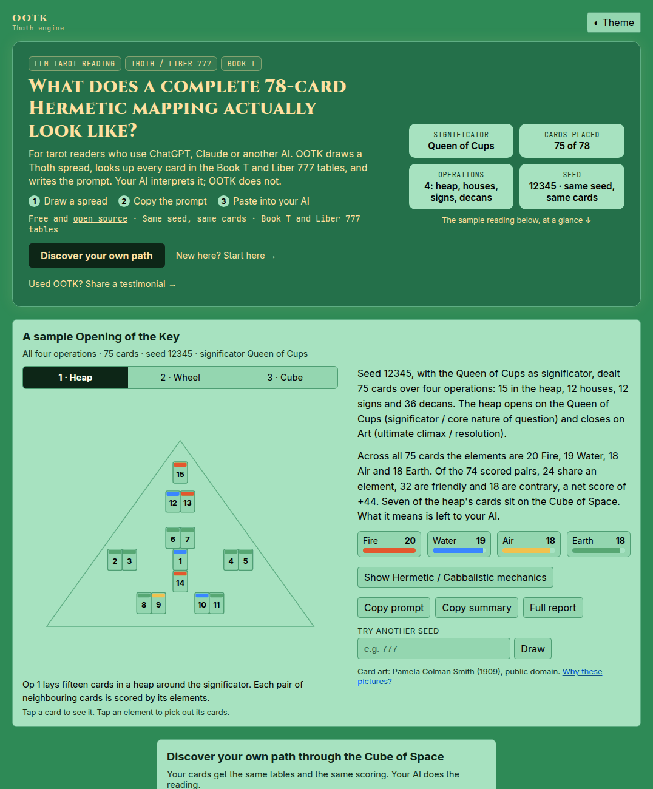

# OOTK Thoth Engine

**OOTK is a neutral instruction set for an LLM to interpret a tarot reading.** It draws a Thoth spread from a seed you can repeat, works out its elemental dignities, aspects and Liber 777 correspondences (up to the full Opening of the Key), and writes them up as a prompt you paste into an LLM. It does not interpret the cards itself.

**Its strengths are objective analysis and clear conceptual models.** Every dignity, aspect and correspondence is looked up from the Book T and Liber 777 tables and scored the same way each time, and the heap, the wheel of houses and signs, and the Cube of Space show where each card sits and how the cards link. The meaning is left to the LLM.

**Try it online: [ootk.onrender.com](https://ootk.onrender.com)** (free hosting, so the first visit after a quiet spell takes about a minute to wake up). Card images there are Pamela Colman Smith's public-domain 1909 Rider-Waite-Smith art, because the Thoth paintings are copyrighted.



It places the Hebrew letters and the Platonic solids in three-dimensional space with two models: the **Cube of Space** from the Sefer Yetzirah (three mother letters as axes, seven doubles as faces and centre, twelve simples as edges) and **polyhedral dual inversions** (each card's solid and its dual; the cube's dual octahedron has its six corners on the Cube of Space's six directions). The [Method page](https://ootk.onrender.com/method#space) explains both and [/maps](https://ootk.onrender.com/maps) draws them.

---

## Features

- **Spreads 1-12**, from a single card up to the full 4-operation OOTK master pipeline (key 12):
  - Operation 1: a 15-card heap (core nature and climax). This is a variant, not the classic OOTK First Operation, which splits the whole deck into four IHVH piles
  - Operation 2: 12 astrological houses
  - Operation 3: 12 zodiacal signs
  - Operation 4: 36 decans, each labelled with its ruler, sign and pip (Decan 1: Mars in Aries (2 of Wands))
  - Each operation reshuffles the whole deck (Operation 1 keeps the seed's own order), so the significator can fall in a house, sign or decan, and a card may appear in more than one operation
- **Three mapping schemes** for tarot-to-Kabbalah attributions: `thoth` (Crowley's swap: the Emperor on Tzaddi, the Star on Heh), `golden_dawn` (the older letters: the Emperor on Heh, the Star on Tzaddi) and `french_egyptian`. The Queen of Wands and Prince of Swords follow the Emperor and the Star. Cube of Space positions and King Scale colours follow the letter, so the swap moves the Emperor and the Star between the Aries and Aquarius edges.
- **Macro frameworks**: `auto`, `light_descent`, `soul_formation`, `life_path`, `post_mortem`.
- **Deterministic PRNG shuffler** (`src/ootk/shuffle.py`), shared by every entry point.
- **PostgreSQL persistence** of sessions, spreads, card pulls and testimonials.
- **Three interfaces**: CLI (`ootk`), FastAPI web GUI (`ootk.web`), and a Rich terminal viewer for saved reports (`scripts/view_output.py`).

---

## Project layout

```
ootk-thoth-engine/
├── pyproject.toml          # Dependencies, dev extras and the `ootk` command
├── src/ootk/
│   ├── cli.py              # Command line: `ootk` / `python -m ootk`
│   ├── web.py              # FastAPI web GUI: `uvicorn ootk.web:app`
│   ├── spreads.py          # Spread definitions, layout coordinates, operation segments
│   ├── analysis.py         # Elements, dignities, geometry, topology, macro framework
│   ├── report.py           # analyze_reading (the one pipeline the CLI and web share), the prompt and HTML export
│   ├── db.py               # DB settings, card lookups, saving sessions
│   ├── shuffle.py          # Seeded shuffler (single source of truth)
│   ├── rules.py            # Book T dignities, aspects and orbs (the one source of scoring rules)
│   ├── significator.py     # Book T significator: court card from description or birth date
│   ├── visual.py           # Web report view: summary figures, drawable layouts, link notes
│   ├── assets.py           # Static files: versioned URLs, cache headers, compression
│   ├── atlas.py            # Card maps: Tree, Cube of Space, decans, solids and elements (/maps)
│   ├── lockout.py          # Locks out repeated wrong passwords (APP_PASSWORD, ADMIN_PASSWORD)
│   └── library.json        # Glossary (/library) and further reading (/history)
├── scripts/
│   ├── check_run.py        # Sanity-checks a saved 4-operation run (run.txt)
│   ├── db_inspect.py       # DB audit / schema / join inspection (audit, schema, joins)
│   ├── download_images.py  # Fetch card images into static/images/
│   ├── optimize_images.py  # Build the WebP copies the web GUI serves
│   ├── make_site_images.py # Rebuild the favicon and link-preview image in static/site/
│   ├── export_hf_space.sh  # Copy the files a Hugging Face Space needs into a folder
│   └── view_output.py      # Render an HTML report in the terminal
├── database/
│   ├── schema.sql          # Full dump: schema, all migrations, and reference data
│   └── migrations/         # Only needed for DBs created before the current schema
├── templates/              # Jinja2 templates for the web GUI and reports
├── static/images/          # Full-size card scans (not in git; see below)
├── static/cards/           # WebP card images served by the web GUI
├── static/js/              # Page scripts, loaded with defer
├── static/fonts/           # Self-hosted Cinzel, Inter and JetBrains Mono (SIL Open Font License)
├── static/history/         # Archival photos for the /history page (credits in CREDITS.md)
├── static/site/            # Favicon, app icon and link-preview image
├── Dockerfile, render.yaml # Container image and Render Blueprint (see Docker, Render and Hugging Face Spaces)
├── deploy/huggingface/     # Space README and start script, also used by the Docker image
├── output/                 # Generated HTML reports (not in git)
├── examples/               # A sample reading made with a dummy seed
├── docs/images/            # README screenshot
└── tests/                  # pytest suite (+ opt-in real-database tests)
```

---

## Prerequisites

- Python 3.11+
- PostgreSQL 16+

---

## Setup

### 1. Clone and install

```bash
git clone git@github.com:hampshirecottage-ai/ootk-thoth-engine.git
cd ootk-thoth-engine

python3 -m venv .venv
source .venv/bin/activate
pip install -c requirements-lock.txt -e ".[dev]"     # the package, its `ootk` command, and test tools
```

`requirements-lock.txt` holds the exact library versions the live site and CI use, so a new release of a dependency changes nothing until that file does.

### 2. Configure the database

```bash
cp .env.example .env
```

Edit `.env`:

```
DB_NAME=my_tarot_db
DB_USER=postgres
DB_PASSWORD=your_password_here
DB_HOST=localhost
DB_PORT=5432
```

Unset values fall back to `my_tarot_db`, `postgres`, `localhost` and `5432`. Keep usernames and passwords in `.env`, never in a tracked file.

Everything else is optional:

| Variable | What it does | Default |
|---|---|---|
| `APP_PASSWORD` | Every web page asks for this password | off |
| `ADMIN_PASSWORD` | Turns on `/admin` for approving testimonials | off (no `/admin` page) |
| `VISITOR_HASH_KEY` | Stores a keyed hash of a testimonial sender's IP address (never the address itself) | off |
| `SITE_URL` | Public address used in link previews, `robots.txt` and `sitemap.xml` | Render's address, then the request's |
| `DB_CONNECT_TIMEOUT` | Seconds to wait for the database before showing the "database down" page | `10` |
| `DB_QUERY_TIMEOUT` | Seconds one database query may take (including waiting on a migration's lock, or a connection that went silent) before it gives up; a reading that can't be saved in time is still shown, with a notice | `15` |
| `WEB_THREADS` | Most report pages built at once, which caps memory | `8` |
| `PGSSLMODE` | Standard PostgreSQL setting; set `require` for a hosted database such as Neon | libpq default |

`DB_PORT`, `DB_CONNECT_TIMEOUT`, `DB_QUERY_TIMEOUT` and `WEB_THREADS` must be whole numbers of 1 or more; a blank or unusable value is ignored (with a warning in the log) and the default is used.

### 3. Create the database

```bash
createdb my_tarot_db
psql -d my_tarot_db -f database/schema.sql
python scripts/db_inspect.py audit
```

`schema.sql` is a full dump: it creates the tables and loads the 78 cards, correspondences and spread geometry, so there is no separate seed step. It already includes everything in `database/migrations/`, which you only need for older databases. It only loads into a new, empty database: if the ootk tables already exist it stops without changing anything, so it can't wipe saved readings.

These commands use your own Postgres role. If your install has a `postgres` superuser, add `-U postgres -h localhost` and set `DB_USER=postgres` in `.env`. On Homebrew installs the role is your macOS username instead, so set `DB_USER` to that.

### 4. Card images (optional)

The card art is Pamela Colman Smith's 1909 Rider-Waite-Smith deck, which is public domain, shown under the Thoth titles (see [static/cards/CREDITS.md](static/cards/CREDITS.md)). The Thoth paintings by Lady Frieda Harris are still under copyright, so they are not in this repository.

The web-sized copies in `static/cards/` are committed, so the GUI shows cards out of the box. The full-size scans (about 50 MB) are not stored in git. Download them with:

```bash
python scripts/download_images.py
```

The web GUI never serves these full-size scans. It uses small WebP copies in `static/cards/` (about 7 MB for all three sizes), which `download_images.py` builds at the end. To rebuild them after changing a scan, run `pip install -e ".[images]"` once, then `python scripts/optimize_images.py`.

---

## Usage

### Command line

```bash
ootk \
  --spread 12 \
  --seed 12345 \
  --mapping french_egyptian \
  --significator "Knight of Swords" \
  --topic "Is everything working correctly?" \
  --html
```

| Flag | Description | Default |
|---|---|---|
| `--spread` | Spread key, 1-12 | asks interactively |
| `--seed` | Seed for deterministic draws (any number or text). Omit it to enter cards by hand | manual entry |
| `--significator` | Significator card title, pinned to position 1 of OOTK Op 1 (spreads 8 and 12) | asks with the Book T questions when the spread needs one |
| `--topic` | Question or intent text | asks interactively |
| `--mapping` | `thoth`, `golden_dawn` or `french_egyptian` | `thoth` |
| `--framework` | `auto`, `light_descent`, `soul_formation`, `life_path`, `post_mortem` | `auto` |
| `--html` | Write an HTML report to `output/` | off |

View the latest saved report in the terminal (needs `rich`: `pip install -e ".[viewer]"`, already part of `[dev]`):

```bash
python scripts/view_output.py            # latest report in output/
python scripts/view_output.py --file output/ootk_output_20.html
```

### Web GUI

```bash
uvicorn ootk.web:app --reload --port 8000
```

Open http://localhost:8000 for the start page. The automatic API docs (`/docs`, `/redoc`, `/openapi.json`) are turned off.

**Pages**

| Address | What it is |
|---|---|
| `/` | Start page: the banner, the form and the testimonial of the day |
| `/pick` | The same form with a spread board and card catalog, to place the cards yourself |
| `/start` | Start here, in folded sections: what OOTK does best, your first reading step by step, a sample Opening of the Key, learning stages, and where the cards come from |
| `/examples` | Example readings with fixed seeds |
| `/library` | Glossary (edit `src/ootk/library.json`), plus every spread |
| `/method` | Intended use, how a reading is made, limitations and what is stored, and why the card art carries Waite names |
| `/maps` | Card maps: where each card sits on the Tree of Life, the Cube of Space, the decans, the Platonic solids and their duals, and the elements |
| `/history` | History of the decks, with archival photos, their credits and further reading |
| `/today`, `/day/<date>` | Card of the day: the top card of the deck shuffled with the date as the seed |
| `/testimonial` | Send a testimonial (one per visitor session); the start page shows one approved testimonial a day |
| `/reading?seed=...&spread=...` | A shared seeded reading, rebuilt from the link and not saved |
| `/report/<link>` | A saved reading |
| `/admin` | Approve, hide or delete testimonials; only exists when `ADMIN_PASSWORD` is set, and nothing links to it |

`/?spread=N` opens the start page with that spread chosen.

- **The form.** Spread, question and Draw my cards. Seed, mapping system and framework sit under **More options**. The page remembers your last settings in your browser, and they carry over to `/pick` ("Pick them by hand").
- **Significator.** Spreads 8 and 12 start with a significator, and the box only appears for those. Choose it one of three ways: **Describe** (Book T: rank from age and gender, suit from colouring or temperament, giving one of the 16 court cards), **Birth date** (the Knight, Queen or Prince ruling that part of the zodiac; worked out in your browser, and only the card is sent), or **Any card**. There is no default card. On `/pick` the first card you place is the significator.
- **Seeds.** Leave the seed blank to get a new one. A seeded report shows the seed, a share link and the matching `ootk` command (under "Run it in the terminal"), and a seeded web reading draws the same cards as `ootk --seed` with the same settings. "Repeat this reading" re-runs it.
- **Report links.** Each saved reading opens at its own address, `/report/<link>`, so you can bookmark it, and reloading it does not save the reading again. The link is a random token, not the session number, so only someone with the exact address can open a reading. Readings saved before links were random get one from `database/migrations/add_report_links.sql`, which also lists every reading's address. Share links (`/reading?seed=...`) carry only the seed and settings, never your question.
- **What now.** The report opens with three steps (cards drawn, copy the prompt, paste it into your AI). **Copy prompt** copies it; **Copy and open** copies it and opens Claude, ChatGPT, Copilot or Grok, filling the prompt in where the site allows it. Gemini and Perplexity are left out because they cut long pasted prompts short. The recommended way, and the one that suits Gemini, is **Save prompt as Markdown (.md)**: it downloads `ootk_report.md`, which you attach in the AI chat with its **+** button. A file gets round the limits AI chats put on pasted text. The prompt names its own last line (`END OF OOTK PROMPT (N positions)`) at the top and asks the AI to say so, rather than interpret, if that line never arrives.
- **Summary first.** Then come a short summary, the elemental balance, dignity and aspect totals and the key cards. Each operation is a collapsed section that opens on click, with its drawing and its card, aspect and dignity tables.
- **Drawings.** Operation 1 is drawn as the 15-card heap inside a triangle (its cards are compared by element only: side-by-side cards in a heap take no astrological aspect), houses and signs as 12-segment wheels (the houses with each house's meaning), and decans as a 36-segment ring, with card images. Switch between **Aspect lines** and **Element pairs**. Layout positions come from `SPREAD_DEFAULT_COORDINATES` in `spreads.py`, the same coordinates the aspects are measured on.
- **How the cards are linked.** Each operation explains in plain words which cards are compared. Tap a card in a drawing to see its element pairs and aspects, each with its score and reason, in an inspector beside the drawing (below it on phones); tap a partner to jump to it.
- **Card details.** "All card details" or any card in a table opens a side panel with its image, attribution, path or Sephira, Hebrew letter, Platonic solid, King Scale colour, small maps of where it sits (as on `/maps`), and every aspect and dignity it takes part in. Escape closes it.
- **Save.** The **Save** menu prints or saves a PDF with every section expanded, downloads the prompt as Markdown, or the whole reading as JSON. Each drawing also downloads as an SVG (card images link back to the running server).

### Docker, Render and Hugging Face Spaces

The `Dockerfile` runs PostgreSQL and the web GUI in one container on port 7860 (or `$PORT` when the host sets it), as a non-root user (uid 1000, which Hugging Face requires). On start it loads `database/schema.sql` into an empty database. It includes the public-domain card art in `static/cards/`, but not the full-size scans.

```bash
docker build -t ootk .
docker run --rm -p 7860:7860 ootk
```

The local database lives inside the container and starts empty on every run. To keep readings, pass `DB_HOST`, `DB_NAME`, `DB_USER` and `DB_PASSWORD` for an external PostgreSQL; the local one is then not started, and the card tables are loaded on first start if missing.

Set `APP_PASSWORD` to make every page ask for that password (any user name works). Ten wrong passwords from one visitor within 15 minutes lock that visitor out for 15 minutes (on Render the visitor is told apart by Cloudflare's `CF-Connecting-IP`, which can't be faked). Saved reports are sent with `Cache-Control: no-store`, and the server's access log shows `/report/<redacted>` instead of report links. Without it, anyone who finds the site can draw readings (which are saved to your database), but can only open a reading if they have its exact link.

On Render's free plan, `render.yaml` is a Blueprint for the same image (the public instance at [ootk.onrender.com](https://ootk.onrender.com) runs this way, with Neon as the database): create a Blueprint from this repository and fill in the `DB_*` settings of an external PostgreSQL (e.g. Neon) and, if you want a password, `APP_PASSWORD` when asked.

Link previews (Open Graph and Twitter tags), `robots.txt` and `sitemap.xml` use the site's public address: `SITE_URL` if you set it, otherwise the address Render gives the service, otherwise the address the page was requested on. Search engines may list the start, pick and guide pages and the card of the day; saved readings (`/report/...`) are marked `noindex` and kept out of the sitemap, and `/reading` share links are disallowed in `robots.txt`. With `APP_PASSWORD` set, crawlers and link previews only see the password prompt. `scripts/make_site_images.py` rebuilds the favicon and the preview image.

For a Hugging Face Docker Space (Docker Spaces need a PRO account since September 2026), `sh scripts/export_hf_space.sh ../ootk-space` copies the files the Space needs, with the Space's README (`deploy/huggingface/README.md`, which sets `sdk: docker` and `app_port: 7860`), into a folder you upload to the Space. Make the Space private, or set `APP_PASSWORD`, if you don't want strangers adding readings to your database.

### Update an existing database

`schema.sql` already contains every migration, so a new database needs none of this. A database made from an older `schema.sql` needs the migrations it is missing, in this order. Each one is safe to re-run.

```bash
psql -d my_tarot_db -f database/migrations/<file>.sql
```

| Migration | Needed when |
|---|---|
| `add_french_number.sql` | `thoth_cards.french_number` is missing |
| `add_report_settings.sql` | `tarot_sessions.report_settings` is missing (the site shows a "needs an update" page) |
| `add_report_links.sql` | Readings saved before links were random; also lists every reading's address |
| `fix_correspondences.sql` | `thoth_cards.attribution` is missing (the engine stops and says so) |
| `fix_trump_attributions.sql` | Each Major's own sign, planet or element as its attribution, path 32 named 'Cross' |
| `fix_court_paths.sql` | Queen of Wands and Prince of Swords on the same paths as the Emperor and the Star; four court descriptions |
| `fix_correspondence_audit.sql` | Six Cube of Space edges as Paul Case gives them, axis directions, French Magus and Priestess planets |
| `add_report_link_index.sql` | Many saved readings: keeps `/report/<link>` fast |
| `add_testimonials.sql` | Testimonials (without it the start page shows none and the testimonial pages ask for the update); lists the approve queries |
| `drop_unused_geometry.sql` | `correspondences` still has `platonic_solid` and the other stored solid columns, or `spread_position_geometry` exists; the app never read them and the solids were out of date |

The web app reads the card and correspondence tables once per process, so restart it after running a migration. For the hosted site the same SQL can be pasted into the database provider's SQL editor (for Neon, the console's SQL Editor).

### Testimonials

New testimonials from `/testimonial` are saved unapproved. With `ADMIN_PASSWORD` set, sign in at `/admin` to approve, hide or delete them (wrong passwords lock out like `APP_PASSWORD`). Without it, approve one with `UPDATE testimonials SET approved = true WHERE testimonial_id = <id>;`. Each is stored with a random session id from a cookie, the time and the browser's user agent, plus a keyed IP hash when `VISITOR_HASH_KEY` is set. Approved testimonials take turns by date and reach the start page within five minutes.

### Sanity-check a full run

```bash
ootk --spread 12 --seed 12345 --mapping french_egyptian \
  --significator "Knight of Swords" --topic "Is everything working correctly?" | tee run.txt
python scripts/check_run.py run.txt
```

`check_run.py` exits 0 when every check passes. WARN lines are known data gaps, not failures.

### Inspect the database

```bash
python scripts/db_inspect.py audit              # consistency checks; exit 1 on failure
python scripts/db_inspect.py schema             # thoth_cards columns, tables, sample row
python scripts/db_inspect.py joins --card-id 1  # one card with all joined correspondences
```

### Tests

```bash
python -m pytest -v
```

The default suite mocks the database. To also run the real SQL against a database built from `schema.sql`:

```bash
createdb ootk_test && psql -d ootk_test -f database/schema.sql
OOTK_TEST_DB=1 DB_NAME=ootk_test python -m pytest tests/test_db_integration.py -v
```

---

## Keeping readings private

The repository holds only the engine and reference data. Your own readings stay on your machine:

- **Readings are stored in your local database.** Each run saves its topic, seed and cards to `tarot_sessions` and related tables. Never commit a dump of your database; `database/schema.sql` contains reference data only, and `*.sqlite`, `*.dump` and `*backup*.sql` files are ignored.
- **Reports and logs are ignored.** `output/`, `outputs/`, `reports/`, `run*.txt` and `*.log` are in `.gitignore`. Check `git status` before committing anyway.
- **Credentials live in `.env`**, which is ignored. Commit changes to `.env.example` only, with empty values.
- **Use dummy seeds in anything you share.** A seed reproduces a reading exactly, so avoid seeds built from birthdates or other personal numbers in examples, tests and issues. `examples/` shows the expected format with seed `12345`.
- **Put anything else personal in `private/`**, which is ignored.

---

## Database model

| Table | Purpose |
|---|---|
| `thoth_cards` | The 78 cards (title, arcana, suit, rank, key scale, attribution) |
| `correspondences` | Hebrew letter, path/sephira, element/planet/sign, King Scale colour, Cube of Space place, and the French/Egyptian letters and paths |
| `tarot_sessions` | One row per reading (operation, significator, notes, and `report_settings` with the report link) |
| `spread_pulls` | Spreads within a session |
| `session_card_pulls` | Each drawn card, its position, and dignity flag |
| `testimonials` | Testimonials sent from `/testimonial`, unapproved until approved at `/admin` |

Relationships: `tarot_sessions` 1-* `spread_pulls` 1-* `session_card_pulls` *-1 `thoth_cards`. Platonic solids, duals and layout coordinates are not stored: the engine works them out from each card's element and from `spreads.py`.

---

## License

MIT. See [LICENSE](LICENSE).
